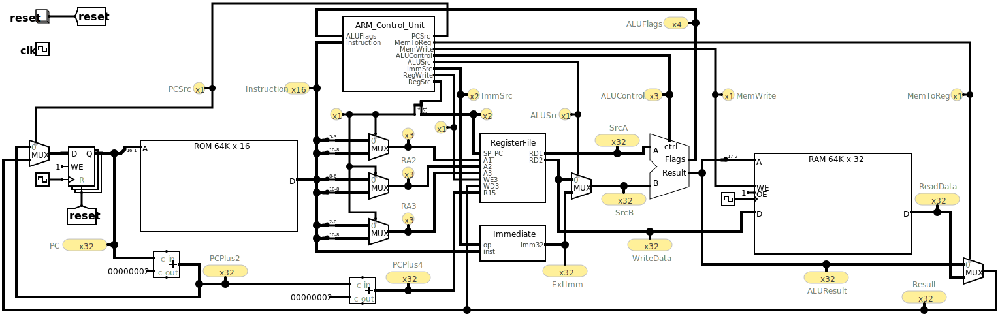

# Xetroc 1.0

This repo contains the digital circuit design of a tiny 32-bit computer for educational purposes.

The CPU has 8 general purpose registers R0..R7, a program counter (PC), and a stack pointer (SP). 

It supports only a minimal set of instructions: 
- data processing: `ADDS/SUBS/MOVS Rd, #imm8`
- data processing: `ADDS/SUBS/MOVS Rd, Rn, Rm`
- memory access: `LDR/STR Rt, [SP, #imm8]`
- control flow: `Bcc #simm8` and `B #simm11`

Besides the CPU, the design includes a 64k 16-bit code ROM and a 64kB 32-bit data RAM.

The complete design is contained in the `main.circ` file, which is to be loaded used with the design and simulation software [logisim-evolution](https://github.com/logisim-evolution/logisim-evolution). Version 3.9 was used for testing.

Instruction mnemonics and binary 16-bit instruction encodings are compatible to the [armv6-m](https://developer.arm.com/documentation/ddi0419/c/Application-Level-Architecture/The-ARMv6-M-Instruction-Set) architecture.

Sample programs are contained in the `*_rom.txt`files which can be loaded into the ROM and executed in a logisim-evolution simulation.

The circuit is based on the Single_Cycle processor in https://github.com/dgsmith1988/Logisim-ARM-Processors which in turn is based on the book
(Digital Design and Computer Architecture - ARM Edition)[https://pages.hmc.edu/harris/ddca/ddcaarm.html] by Sarah L. Harris and David Harris.
Signal and component names and the overall structure is very close to the book. The main difference is the new Instruction_Decoder which is for 16-bit instructions, not 32-bit instructions.

The Instruction_Decoder in the Control_Unit was generated from the `Instruction_Decoder_TruthTable.txt` truth table description which makes it easier to study and modify. There are no HDL components involved.

The code can be executed on a real MCU featuring an Arm Cortex-M core which was tested on STM32 Nucleo boards. You only need to setup SP to a reasonable RAM address.

A C program can be used as a starting point and compiled with `arm-none-eabi-gcc -g -mcpu=cortex-m0 -mthumb -fomit-frame-pointer`. 
Of course, the compiled assembly or machine code must be trimmed to stick to the restricted instruction set. Neither function calls nor returns are implemented.

## Limitations
- There are two separate memories RAM and ROM which is needed for a single cycle design,
- the most significant address bits are not evaluated for the ROM and RAM,
- the datapath is limited and cannot support some armv6-m instructions like STR Rt, [Rn, Rm] or LDR Rt, [PC, #imm8],
- the Control_Unit decodes only a subset of instruction formats,
- RAM access is 32-bit only,
- the stack pointer is fixed at RAM address 0x20000000 and cannot be modified.

If you find a bug or have a suggestion, feel free to open an issue or submit a pull request. 

At the moment, the goal is to keep the design simple, not to create a fully blown model.